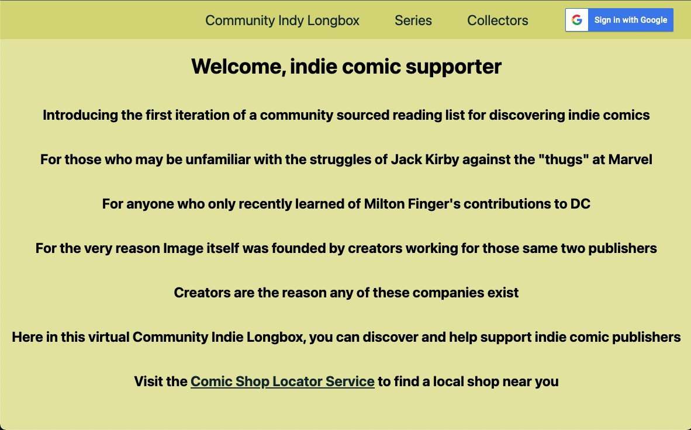
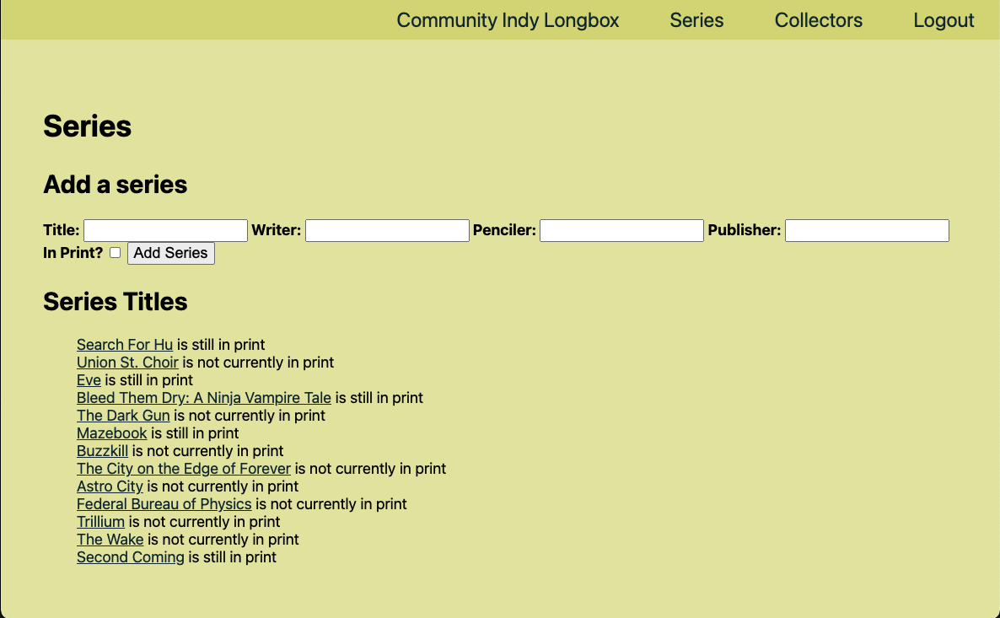
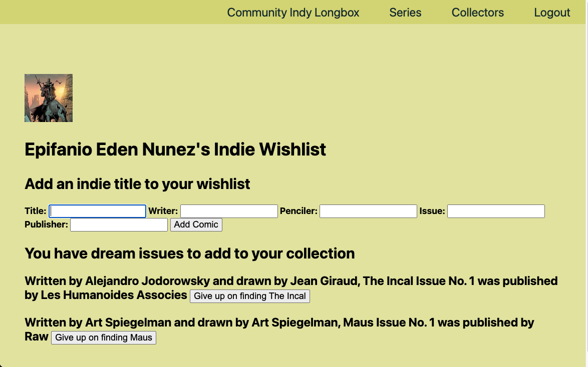

# **Community Indie Longbox**
 
 
 #### Inspired by the struggles of Bill Finger, Jack Kirby, and Robert Kirkman, by their struggles against big publishers and their corporate overlords. This website is a user-sourced public list of independent comics to help support smaller publishers and local artists through this online source coupled with your friendly local comic shop.

 Link here:
 [_Join the_ **Indie Longbox Community** _now_!](https://indy-longbox.herokuapp.com/)
 >"I felt the comics grew because they became the common man's literature, the common man's art, the common man's publishing." -- Jack Kirby

 ## _Website Navigation_

This version of the app was built with **Mongoose**, **Express**, **Node** and **JavaScript** with the help of _Visual Studio Code_.

## _Website Instructions_

Homepage 

Creating Series

Profile view with wishlist

 
 ## _Icebox_

 * Trading and Selling
 * Images Sourcing for Quality of Comics
 * Volume and Collection Integration